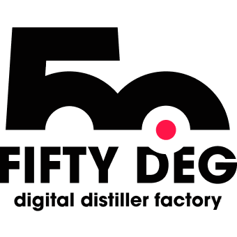

    

    

<h1 align="center">Sylius Robots Plugin</h1>

A Sylius plugin that allows configuring different robots.txt per each channel.

 

# Fifty Deg

## About US
We are an Italian Digital Company focused on:
- e-commerce development
- custom Web App implementation
- <a href="https://tinees.com/join-tinees/" target="_blank">Tinees</a>, our core project that aims to safeguard and sensitize people on the cultural, artistic and historical heritage of a nation.

## Documentation

For a comprehensive guide on Sylius Plugins development please go to Sylius documentation,
there you will find the <a href="https://docs.sylius.com/en/latest/plugin-development-guide/index.html">Plugin Development Guide</a>, that is full of examples.

<ul>
<li><a href="doc/installation.md">Installation</a></li>
<li><a href="doc/usage.md">Usage</a></li>
<li><a href="doc/customization.md">Customization</a></li>
<li><a href="doc/development.md">Development</a></li>
<li><a href="doc/testing.md">Testing</a></li>
</ul>

## License
This plugin's source code is completely free and released under the terms of the MIT license.
 
 
 
 

## Get in touch
<a href="https://fiftydeg.com/" target="_blank">fiftydeg.com</a>
<a href="https://www.linkedin.com/company/fiftydeg/" target="_blank" rel="nooperer noreferrer">Linked In</a>
